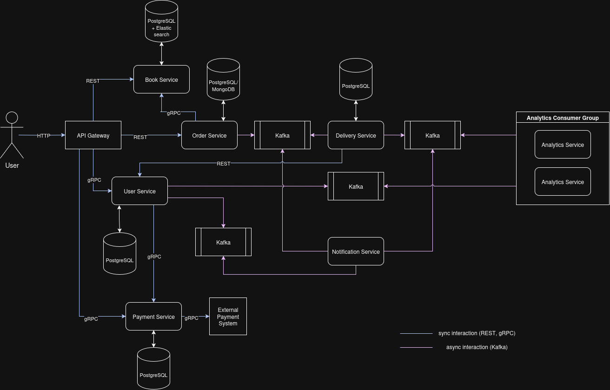

# ДЗ 2. Микросервисная архитектура

*Саму схему смотреть в imgs/MSA.drawio.png*

Необходимо предложить архитектуру приложения для цифровизации библиотеки. Приложение должно реализовывать уже существующий функционал:
- ведение карточек пользователей и книг
- ведение учета выданных и возвращенных книг
- отправка уведомлений пользователям с невозвращенными книгами
- формирование графика выдачи книг
- взимание платы за испорченные книги

А также новый функционал:
- возможность заказа книги онлайн
- организация доставки и возврата книг курьерами
- организация безналичной оплаты

На схеме нужно указать:
- способ взаимодействия между микросервисами
- инструменты, позволяющие реализовать это взаимодействие
- инструменты хранения данных микросервиса

А также предложить набор метрик для отслеживания работоспособности и нагрузки на систему

# Реализация

С учетом того, что у нас уже есть готовая структура взаимодействия, взятая с бизнес-процессов реальной библиотеки, спроектируем микросервисную архитектуру приложения на основе Domain Driven Design(DDD) подхода

DDD подход отлично применим, когда нужно реализовать архитектуру с глубоким пониманием предметной области. Так как наша задача - реализовать социально-значимый проект для государственного учреждения, для удобства пользователей, нам необходимо глубокое понимание предметной области

Но вместе с DDD мы внесем части от Event Driven Architecture, так как мы имеем части системы с асинхронным типом взаимодействия, так что реализация очередей событий поможет увеличить масштабируемость и отказоустойчивость, а также асинхронно и даже паралелльно обрабатывать события (вместо запросов)

## Шаг №1 -- погружение в предметную область

цель: понять внтуренние бизнес-процессы и ключевые проблемы (домены)

### Введем список терминов
\
**Сущности**
- System -- система(само приложение)
- User -- пользователь
- Book -- книга (единица взаимодействия)
- Order -- заказ книги пользователем
- Delivery -- доставка книги пользователю
- Return -- заказ на обратную доставку книги
- Notification -- уведомление о событиях для пользователя 
- Penalty -- штраф за просроченную книгу
- Report -- график выдачи книг
- Metrics -- статистики системы

**Процессы**
- Бронирование
- Осуществление доставки книги
- Возврат книги
- Факт просроченной книги
- Оплата штрафа
- Запись карточки
- Отправка уведомления о просроченной книге
- Регистрация пользователя

**Состояния**
- Available -- книга готова к выдаче
- Booked -- книга забронирована
- Overdue -- книга просрочена
- Fixing -- книга в ремонте

**Бизнес-термины**
- Penalty - штраф за просрочку книги

**Взаимодействия между областями**
- Event -- сообщение об изменении состояния (BookReturned)
- Command -- запрос на выполнение действия (ChargePenalty)

### Введем список ключевых бизнес-процессов

**1. Регистрация пользователей (User Registry)**

*Участники*
- User
- System
- Notification

*Шаги*
1. `User` заполняет форму регистрации (ФИО, email, телефон)
2. `User` сохраняется в базу данных
3. Генерируется `Event` регистрации пользователя
4. Отправляется приветственное `Notification`

*Пример* \
`User` запрашивает у `System` форму регистрации, вводит данные, отправляет форму, получает `Notification` об успешной регистрации и статус `Registered`

**2. Доставка книги (Book Delivery)**

*Участники*
- User
- System
- Book
- Order
- Delivery
- Notification

*Шаги*
1. `User` выбирает `Book`
2. `System` проверяет состояние `Book` на `Available`
3. `System` запрашивает адрес и время `Delivery`
4. `User` вводит необходимые данные
5. `System` создает `Order`
6. `System` ставит состояние для `Book` -- `Booked`
7. `System` генерирует `Event` о запросе `Delivery`
8. `System` присылает `Notification` о состоянии `Order` и `Delivery`

*Пример*

`User` выбирает `Book` "Война и мир" в `System`, которая проверяет статус `Available`. `System` запрашивает адрес доставки и удобное время. `User` указывает адрес. `System` создает `Order` #123, меняет статус `Book` на `Booked`, генерирует `Event` "Delivery requested" и отправляет `Notification`: "Ваш заказ #123 на книгу 'Война и мир' оформлен. Доставка ожидается в указанное время"

**3. Возврат книги (Book Return)**

*Участники*
- User
- System
- Book
- Order
- Delivery
- Notification
- Penalty
- Payment

*Шаги*
1. `User` запрашивает у `System` возврат для конкретной `Book`
2. `System` предлагает дату и время
3. `User` выбирает дату и отправляет запрос
4. `System` оформляет `Order`
5. `System` генерирует `Event` о запросе `Delivery`
6. `System` проверяет статус `Book` на `Overdue`
7. При наличии у `Book` статуса `Overdue`, `System` назначает `Penalty` для `User`
8. `System` отправляет `Notification` о состоянии `Order`, `Delivery` и статуса `Book`. При наличии `Penalty` уведомляет о сумме и сроках `Payment`

*Пример*

`User` запрашивает возврат `Book` "1984" через `System`. `System` предлагает дату 25.05, `User` подтверждает. `System` создает `Order` #456, генерирует `Event` "Return delivery scheduled", но обнаруживает статус `Overdue` (книга просрочена на 7 дней). `System` назначает `Penalty` в размере 500 руб., отправляет `Notification`: "Запрос на возврат книги '1984' (заказ #456) принят. Доставка 25.05. Штраф за просрочку: 500 руб. Оплатите до 30.05."

**4. Оплата штрафа (Penalty Payment)**

*Участники*
- System
- User
- Penalty
- Payment
- Notification

*Шаги*
1. `User` запрашивает у `System` форму `Payment` конкретного `Penalty`
2. `User` вводит нужные данные
3. `User` отправляет форму
4. `System` выполняет `Payment`, списывает сумму `Penalty`
5. В случае успеха `System` удаляет `Penalty`, генерирует `Event` об успешной оплате
6. `System` отправляет `Notification` о состоянии `Payment`

*Пример*

`User` открывает в `System` форму оплаты для `Penalty` #789 (500 руб.), вводит данные карты и подтверждает платеж. `System` списывает 500 руб., удаляет `Penalty` #789, генерирует `Event` "Penalty paid" и отправляет `Notification`: "Штраф #789 успешно оплачен. Сумма: 500 руб. Статус: Completed".

### Use-Case Diagram

## Шаг №2 -- доменные области и bounded contexts
Шаг №2 - разделение системы на доменные области, решающие по одной бизнес-проблеме и на bounded contexts - границы области

### Домен "Пользователи" (*bounded context:* User Management)

**Сущности**
- User
- Role

**Зона ответственности**
- Регистрация, аутентификация
- Назначение `Role` (авторизованный пользователь, курьер, библиотекарь)
- Ведение профиля(карточки) `User` (данные, контактный номер, статус заказов и доставок, книги во владении)
- Хранение `User` 
***

### Домен "Книги" (*bounded context:* Book Management)

**Сущности**
- Book

**Зона ответственности**
- Хранение `Book` (название, автор, кол-во страниц)
- Выдача статуса `Book` (`Available`, `Booked`, `On repair`, `Overdue`)
***

### Домен "Заказы" (*bounded context:* Order Management)

**Сущности**
- Order
- Penalty

**Зона ответственности**
- Оформление `Order` на выдачу книги
- Оформление `Order` на возврат книги
- Начисление `Penalty` в случае просрочки книги
***

### Домен "Доставка" (*bounded context:* Delivery Management)

**Сущности**
- Delivery

**Зона ответственности**
- Назначение `Delivery` для выдачи
- Назначение `Delivery` для возврата
***

### Домен "Оплата" (*bounded context:* Payment Management)

**Сущности**
- Payment

**Зона ответственности**
- Осуществление безналичной `Payment`
- Интеграция с платежной системой
***

### Домен "Уведомления" (*bounded context:* Notification Management)

**Сущности**
- Notification

**Зона ответственности**
- Отправка `Notification`
***

### Домен "Аналитика" (*bounded context:* Analytics Management)

**Сущности**
- Report
- Metrics

**Зона ответственности**
- Формирование графика выдачи книг (`Report`)
- Сбор и хранение `Metrics`

## Шаг №3 -- микросервисы

Шаг №3 -- назначение ответственных микросервисов по границам контекста

- Для `User Management` -- `User Service`
- Для `Book Management` -- `Book Service`
- Для `Order Management` -- `Order Service`
- Для `Delivery Management` -- `Delivery Service`
- Для `Payment Management` -- `Payment Service`
- Для `Notification Management` -- `Notification Service`
- Для `Analytics Management` -- `Analytics Service`

## Шаг №4 -- способы взаимодействия между микросервисами
Шаг №4 -- выбор способов общения и организация взаимодействия между сервисами

Разделим все взаимодействие на два типа:
- Синхронное взаимодействие
- Асинхронное взаимодействие

### Синхронное взаимодействие

Синхронное взаимодействие необходимо в тех частях системы, где ожидается немедленный ответ системы, а именно:
- Регистрация и верификация пользователя
- Проверка доступности книги
- Осуществление платежа

Для синхронного взаимодействия будем использовать **REST API** на базе Spring Boot для осуществления HTTP запросов к сервисам и получения от них HTTP ответов 

В слабых, узкиз местах системы, где на сервисы приходит большая нагрузка будем использовать формат **gRPC** общения для ускоренного взаимодействия

### Асинхронное взаимодействие

Асинхронное взаимодействие реализовано в тех частях системы, где ответ системы не обязателен, а само событие может быть выполнено не моментально, а с небольшой задержкой, например:
- Назначение штрафа
- Назначение курьера
- Отправка уведомлений

Асинхронное взаимодействие является Event Driven взаимодействием и базируется на отклике на появление событий

Также на появившееся события будет реагировать уже не один сервис (как в синхронном), а сразу несколько, поэтому будем использовать брокер сообщений

Так как нам нужно организовать не только отклик на события, но и их хранение + нам важна масштабируемость и оптимизация, будем использовать **Apache Kafka** в роли брокера сообщений

Kafka также позволит нам указать гарантии доставки сообщений, что повысит скорость и отказоустойчивость

### Точка входа

Для того чтобы сервисы не обращались каждый раз к `User Service` за подтверждением статуса авторизации пользователя реализуем единую точку входа для всех запросов - **Gateway API**, например Nginx или Kong

Клиент всегда будет обращаться именно к Gateway API, который будет перенаправлять запросы

Для обнаружения сервисов, балансировки нагрузки, TLS и снятие метрик будем использовать -- **Service Mesh**, например Istio

## Шаг №5 -- Хранение данных

Для хранения данных будем использовать в основном СУБД - PostgreSQL, в некоторых случаях можно использовать и другой подход
- `User Service` - PostgreSQL - Сложные запросы (роли, история активности)
- `Book Service` - PostgreSQL + Elasticsearch - Хранение метаднных и статуса книг. Можно использовать Elasticsearch для поиска книг
- `Order Service` - PostgreSQL/MongoDB - Гибкая схема для хранения заказов (статусы, изменения), можно использовать MongoDB для хранения JSON
- `Delivery Service` - PostgreSQl - Транзакции (выдача/возврат) 
- `Payment Service` - PostgreSQL - ACID транзакции для платежей

Также будем использовать паттерн Saga для имитации распределенных транзакций

## Шаг №6 -- Метрики для отслеживания работоспособности и нагрузки на систему

Будем снимать метрики с помощью **Prometheus**, а визуализировать их с помощью **Grafana**, трейсинг для latency будем проводить с помощью **Jaeger**

Метрики:
- CPU Usage -- загрузка процессора
- Memory Usage -- потребление RAM
- Disk I/O -- нагрузка на запись/чтение
- Network Latency -- задержка между микросервисами (Istio)
- Request Rate (RPS) -- количество запросов в секунду
- Latency -- время ответа сервиса
- Timeout Rate -- % таймаутов при вызовах между сервисами

Бизнес-метрики:
- Active Users -- количество уникальных пользователей за неделю
- Books Booked -- число выданных книг в день
- Delivery Success Rate -- % успешных доставок
- Payment Proccessing time -- время проведенея платежа

## Шаг №7 -- Тестирование

Для обеспечения отказоустойчивости будут проводиться следующие тесты:
- Unit-тесты -- логика внутри классов/модулей
- Интеграционные тесты -- взаимодействие сервиса с БД
- Контрастные тесты -- совместимость API между сервисами
- Event-тесты -- корректность генерации и обработки событий
- E2E -- полное тестирование сценария работы от начала до конца
- Нагрузочное тестирование -- тестирование искусственной нагрузкой
 
## Схема архитектуры

***
Выполнено в рамках лучшего учебного ИТ-лагеря от Т1

Автор: Давлетов Тимур
